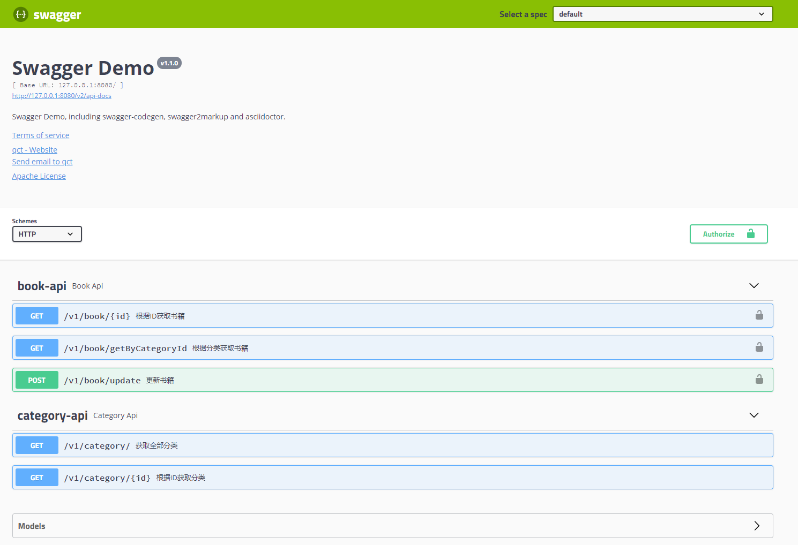

# Swagger 示例
- [快速开始](#快速开始)  
- [OpenAPI 和 Swagger](#openapi-和-swagger)
  * [OpenAPI](#openapi)
  * [Swagger](#swagger)
  * [为什么要使用OpenAPI](#为什么要使用openapi)
- [OpenAPI规范介绍](#openapi规范介绍)
  * [基本结构](#基本结构)
  * [元数据](#元数据)
  * [基本URL](#基本url)
  * [消费和生产](#消费和生产)
  * [路径](#路径)
  * [参数](#参数)
  * [响应](#响应)
  * [输入和输出模型](#输入和输出模型)
  * [认证](#认证)
- [Swagger工具箱介绍](#swagger工具箱介绍)
  * [Swagger Editor](#swagger-editor)
  * [Swagger Codegen](#swagger-codegen)
  * [Swagger UI](#swagger-ui)
- [asciidoctor](#asciidoctor)
  

## 快速开始

1. install: git clone 之后, 在根目录执行:

```
swagger-server/bin/install.sh
```

会生成几种客户端SDK、服务器端stub和asciidoc、html文档，目录结构如下:

```
+---asciidoc                    //asciidoc文档
+---client                      //自动生成的客户端
|   +---go                      //--go语言客户端
|   +---html2                   //--html文档
|   \---java                    //--java客户端
+---docs                        //html文档
|       swagger-example.html  
+---server                      //自动生成的服务器端stub
|   +---jaxrs-resteasy          //--使用resteasy生成jaxrs的服务器端stub
|   \---spring                  //--spring服务器端stub
\---swagger-server              //一个server的例子， 可以生成swagger.json
```

2. 运行swagger-server：

```
java -jar swagger-server/target/swagger-server-${version}.jar
```

3. 探索

swagger.json: `http://127.0.0.1:8080/v2/api-docs`

swagger-ui: `http://127.0.0.1:8080/swagger-ui.html`

swagger-ui 长这样:


---
### ***OpenAPI 和 Swagger 开源工具介绍***

## OpenAPI 和 Swagger
### OpenAPI
OpenAPI规范(以前叫Swagger规范)是Linux基金会的一个项目，试图通过定义一种用来描述API格式或API定义的语言，来规范RESTful服务开发过程。OpenAPI规范帮助我们描述一个API的全部信息，比如：

* 可用路径（```/users```）和每个路径上的可用操作（```GET /users```, ```POST /users```）
* 每个操作的输入/输出参数
* 安全认证方法
* 联系信息、许可证、使用条款和其他信息

我们可以选择使用JSON或者YAML的语言格式来编写API文档， 这两种格式对人和机器都是可读的。完整的OpenAPI 规范如下：
[OpenAPI 2.0 Specification](https://github.com/OAI/OpenAPI-Specification/blob/master/versions/2.0.md),
[OpenAPI 3.0 Specification](https://github.com/OAI/OpenAPI-Specification/blob/master/versions/3.0.0.md)

### Swagger

Swagger是围绕OpenAPI规范建立的一系列工具，可以帮我们设计、构建、编写文档和消费REST APIs

主要工具包括：
* Swagger Editor – 基于浏览器的编写OpenAPI文档的工具
* Swagger Codegen – 从OpenAPI文档生成服务器和客户端代码
* Swagger UI – 把OpenAPI文档转换成交互式文档的工具

### 为什么要使用OpenAPI
API描述自己结构的能力是OpenAPI中所有卓越功能的根源。一旦写好OpenAPI文档，OpenAPI规范和Swagger工具可以通过各种方式进一步驱动API开发：

* 对于先有设计的用户：使用Swagger Codegen为API来生成服务器存根。唯一剩下的就是实现服务器逻辑 - API已经准备好了！
* 使用Swagger Codegen，可以为40多种语言的API 生成客户端。
* 使用Swagger UI生成交互式API文档，让用户直接在浏览器中尝试API调用。
* 使用OpenAPI规范文档将API相关工具连接到API。例如，将规范导入到SoapUI中，为API创建自动测试。
* 更多和Swagger集成工具：[open-source tools](https://swagger.io/open-source-integrations/)

-----

## OpenAPI规范介绍

### **基本结构**
Swagger可以用JSON或YAML编写。在本例中，我们只使用YAML示例，但JSON工作效果一样好。

用YAML编写的Swagger示例示例如下所示：
```yaml
swagger: "2.0"
info:
  title: Sample API
  description: API description in Markdown.
  version: 1.0.0

host: api.example.com
basePath: /v1
schemes:
  - https

paths:
  /users:
    get:
      summary: Returns a list of users.
      description: Optional extended description in Markdown.
      produces:
        - application/json
      responses:
        200:
          description: OK
```


### **元数据**
每个Swagger规范文档以Swagger版本开始，3.0是最新版本。Swagger版本定义了API规范的整体结构 - 可以记录什么以及如何记录它。

```yaml
swagger: "2.0"
```

然后，需要指定```API info```，```title```（```description```可选），```version```（API的版本，而不是文件版本或Swagger版本）。

```yaml
info:
  title: Sample API
  description: API description in Markdown.
  version: 1.0.0
```

```version``` 可以是一个任意字符串。可以使用major.minor.patch（如语义化版本控制规范），或任意格式，如1.0-beta或2016.11.15。

```description``` 支持多行和GitHub Flavored Markdown，用于丰富的文本表示。

```info``` 还支持其他字段, 比如联系信息，许可证和其他详细信息。   


### **基本URL**
所有API调用的基本URL由```schemes```，```host```和```basePath```定义：

```yaml
host: api.example.com
basePath: /v1
schemes:
  - https
```

所有API路径都是相对于基本URL。例如，/users实际上是指*https://api.example.com/v1/users*。

*更多*: [API Host and Base URL](https://swagger.io/docs/specification/2-0/api-host-and-base-path/).

### **消费和生产**

```consumes``` 与 ```produces``` 部分定义API所支持的MIME类型。根级别定义可以在各个操作中被覆盖。   

```yaml
consumes:
  - application/json
  - application/xml
produces:
  - application/json
  - application/xml
```
  
*更多*: [MIME Types](https://swagger.io/docs/specification/2-0/mime-types/).
  
### **路径**
该```paths```部分定义了API中的各个端点（路径）以及这些端点支持的HTTP方法（操作）。例如，```GET /users```可以描述为：
```yaml
paths:
  /users:
    get:
      summary: Returns a list of users.
      description: Optional extended description in Markdown.
      produces:
        - application/json
      responses:
        200:
          description: OK
          
```

*更多*: [Paths and Operations](https://swagger.io/docs/specification/2-0/paths-and-operations/).

### **参数**
操作可以包含参数，可以通过URL path（```/users/{userId}```），query string（```/users?role=admin```），headers（```X-CustomHeader: 
Value```）和请求体传递的参数。可以定义参数类型，格式，是否需要或可选，以及其他详细信息：
```yaml
paths:
  /users/{userId}:
    get:
      summary: Returns a user by ID.
      parameters:
        - in: path
          name: userId
          required: true
          type: integer
          minimum: 1
          description: Parameter description in Markdown.
      responses:
        200:
          description: OK
```

*更多*: [Describing Parameters](https://swagger.io/docs/specification/2-0/describing-parameters/).

### **响应**
对于每个操作，可以定义可能的状态代码，例如200 OK或404 Not Found，以及```schema```响应内容。响应内容可以通过内联定义或从外部定义引用```$ref```。还可以为不同的内容类型提供示例响应。
```yaml
paths:
  /users/{userId}:
    get:
      summary: Returns a user by ID.
      parameters:
        - in: path
          name: userId
          required: true
          type: integer
          minimum: 1
          description: The ID of the user to return.
      responses:
        200:
          description: A User object.
          schema:
            type: object
            properties:
              id:
                type: integer
                example: 4
              name:
                type: string
                example: Arthur Dent
        400:
          description: The specified user ID is invalid (e.g. not a number).
        404:
          description: A user with the specified ID was not found.
        default:
          description: Unexpected error
```

*更多*: [Describing Responses](https://swagger.io/docs/specification/2-0/describing-responses/).

### **输入和输出模型**
全局```definitions```部分允许定义API中使用的公共数据结构。每当```schema```需要时，可以使用```$ref```引用它们，无论是请求体和响应体。

例如，这个JSON对象：
```json
{
  "id": 4,
  "name": "Arthur Dent"
}
```
可以表示为：
```yaml
definitions:
  User:
    properties:
      id:
        type: integer
      name:
        type: string
    # Both properties are required
    required:  
      - id
      - name

```

然后在request body和response body中引用如下：

```yaml
paths:
  /users/{userId}:
    get:
      summary: Returns a user by ID.
      parameters:
        - in: path
          name: userId
          required: true
          type: integer
      responses:
        200:
          description: OK
          schema:
            $ref: '#/definitions/User'
  /users:
    post:
      summary: Creates a new user.
      parameters:
        - in: body
          name: user
          schema:
            $ref: '#/definitions/User'
      responses:
        200:
          description: OK
```


### **认证**

```securityDefinitions``` 和 ```security``` 关键字用于描述API中使用的身份认证方式。

```yaml
securityDefinitions:
  BasicAuth:
    type: basic

security:
  - BasicAuth: []
```


支持的认证方法有：

* [Basic authentication](https://swagger.io/docs/specification/2-0/authentication/basic-authentication/)
* [API key](https://swagger.io/docs/specification/2-0/authentication/api-keys/) (as a header or query parameter)
* OAuth 2 common flows (implicit, password, application and access code)

*更多*: [Authentication](https://swagger.io/docs/specification/2-0/authentication/).

## Swagger工具箱介绍
### **Swagger Editor**
Swagger Editor是第一个开源的专注于Swagger-based APIs的编辑器， 
可以设计、描述、记录API。Swagger编辑器非常适合快速入门Swagger规范。它清爽，高效，并具有许多功能，可帮助设计和记录RESTful接口，开箱即用。

Swagger Editor允许在浏览器内的YAML中编辑Swagger API规范，并实时预览文档。然后可以使用完整的Swagger工具（代码生成，文档等）。

* 在任何地方运行: 编辑器可以工作在任何开发环境中，无论是在本地还是在网络中
* 智能反馈：输入时有简明反馈和错误提示以及验证Swagger-compliance的语法
* 即时可视化：当你还在定义API文档时就直观地呈现，同时与API进行交互
* 智能自动完成：通过智能自动完成来更快编写
* 完全可定制：轻松配置和自定义任何东西，从行间距到主题
* 关于构建：为API生成每种流行语言的服务器端和客户端

### **Swagger Codegen**
使用Swagger Codegen，对于每种流行语言，可以更快地构建和改善基于Swagger定义的API。Swagger 
Codegen可以从Swagger规范生成服务器端和客户端SDK来简化构建过程，因此团队可以更好地关注API的实现和适配。

* 生成服务器：通过生成超过20种不同语言的样板服务器代码来消除繁琐的调整和配置
* 改善API消费：生成超过40种不同语言的客户端SDK，使客户端开发人员轻松与API集成
* 持续改进：Swagger Codegen始终使用编程世界中最新和最好的改进进行更新

### **Swagger UI**
Swagger UI允许任何人，无论是开发团队还是最终消费者，都可以可视化地与API资源进行交互，而无需有任何实现逻辑。它是从Swagger规范自动生成的，可视化文档使后端实现和客户端消费变得容易。

* 依赖关系：在任何环境中托管Swagger UI
* 人性化：允许客户端开发人员轻松交互，并尝试API暴露的每个操作，以方便消费
* 易于导航：通过整齐分类的文档快速查找和使用资源和端点
* 所有浏览器支持：Swagger UI可以在所有主流浏览器中运行
* 完全可定制：代码完全开源，可以个性化定制和调整Swagger UI

## **asciidoctor**
* asciidoc
* asciidoctor

Asciidoctor是一种用于将AsciiDoc内容转换为HTML5，DocBook 5（或4.5）和其他格式的快速文本处理器和发布工具链。Asciidoctor是用Ruby编写的，封装成RubyGem并发布到RubyGems
.org。该Gem还包含在几个Linux发行版中，包括Fedora，Debian和Ubuntu。Asciidoctor是开源的，托管在GitHub上，并根据MIT许可证发布。
